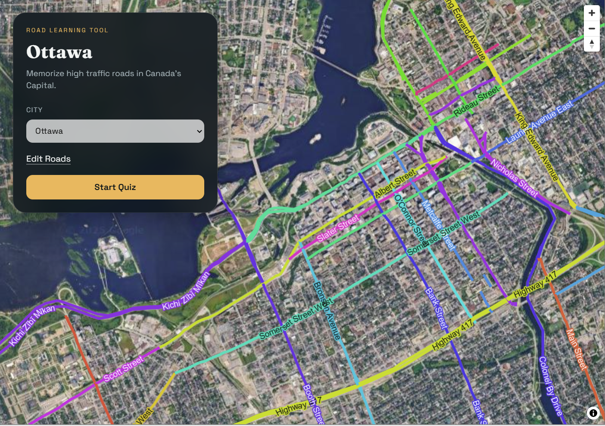

# Road Learning Tool

Welcome to the Road Learning Tool! This application is designed to help users learn road rules and signs effectively. Built with React, TypeScript, and Vite, it offers a modern and responsive learning experience.

## Technologies Used

- **Frontend Framework:** React
- **Language:** TypeScript
- **Build Tool:** Vite
- **Linting:** ESLint

