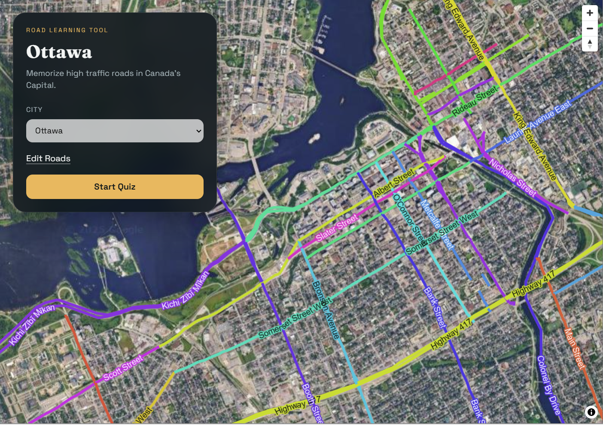

# Road Learning Tool

An interactive map-based quiz application for memorizing the high-traffic roads of
a city and, for Queen's University, the buildings of its campus. Roads and
buildings are rendered as coloured overlays on satellite imagery, and a built-in
quiz engine challenges the user to locate a named feature on the map.

The application is live at:
<https://julienchagnon.github.io/Road-Learning-Tool/>



## Features

- **Interactive satellite map** built on MapLibre GL with Google satellite imagery
  as the base layer.
- **Road quiz** - a named road is requested and the user clicks it on the map.
  Answers are scored per session, with correct and incorrect roads highlighted.
- **Building quiz** (Queen's University campus only) - the same mechanic applied
  to named campus buildings.
- **Three cities** - Ottawa/Gatineau (default), Montreal, and Kingston (Queen's
  University), each with its own pre-built tiles and road catalogue.
- **Fuzzy road matching** so a road can be found despite spelling, diacritic, or
  abbreviation differences (for example "Bank", "Bank Street", or
  "boulevard alexandre tache").
- **Editable road set** - users can add or remove the roads included in a quiz,
  and Ottawa offers a toggle for including or excluding Gatineau roads.
- **Shareable URLs** - application state (city and active quiz) is encoded in the
  URL hash, so a given view can be linked directly.

## Technology Stack

| Concern        | Choice                                   |
| -------------- | ---------------------------------------- |
| UI framework   | React 19                                 |
| Mapping        | MapLibre GL                              |
| Build tooling  | Vite                                     |
| Language       | JavaScript (JSX)                         |
| Linting        | ESLint                                   |
| Hosting        | GitHub Pages (served from `docs/`)       |
| Data pipeline  | DuckDB and Tippecanoe (tile generation)  |

## Getting Started

### Prerequisites

- Node.js (version 18 or later is recommended)
- npm

### Installation

```bash
npm install
```

### Available Scripts

```bash
npm run dev            # Start the Vite development server
npm run build          # Produce a production build in docs/
npm run preview        # Preview the production build locally
npm run lint           # Run ESLint
npm run rebuild-tiles  # Regenerate vector tiles (requires DuckDB and Tippecanoe)
```

The build output is written to `docs/` rather than `dist/` because the site is
deployed through GitHub Pages from the `docs/` folder. The application is served
under the base path `/Road-Learning-Tool/`, configured in `vite.config.js`.

## Architecture

The application is a single-page React app. `src/App.jsx` is a thin shell that
tracks the visual viewport height (so the layout behaves correctly on mobile
browsers) and injects the Matomo analytics tag. All of the application logic lives
in `src/MapView.jsx` and the supporting modules under `src/map/`.

### Source layout

```
src/
  App.jsx          Viewport sizing and analytics; renders MapView
  MapView.jsx      The React component: state, effects, and UI
  main.jsx         React entry point
  App.css          Application styles
  map/
    config.js      City configuration, tile and source identifiers, raster
                   base-map style, popular-road lists, and label overrides
    routing.js     Hash-based URL routing (parsing city and quiz from the URL)
    colors.js      Colour hashing and MapLibre paint expressions, including
                   text-contrast and building-colour helpers
    roads.js       Road catalogue indexing, fuzzy token matching, and the
                   MapLibre filter, colour, and label expressions for roads
    quiz.js        Quiz utilities: queue shuffling, scoring messages, and
                   feature-to-token matching for click handling
    buildings.js   Kingston building catalogue, label canonicalization,
                   geometry centroids, and building paint expressions
    layers.js      Creation and teardown of MapLibre sources and layers
```

`MapView.jsx` orchestrates everything: it owns the React state and effects, wires
up the MapLibre instance, and renders the control panel and quiz UI. The modules
in `src/map/` are pure helpers and configuration with no React dependency, which
keeps the component focused on behaviour rather than data and map plumbing.

### Map rendering

The base layer is Google satellite imagery served as raster tiles. On top of it,
roads and (for Kingston) building outlines are drawn from static vector tiles
stored as Protocol Buffer (PBF) files at
`public/assets/tiles/{city}/{z}/{x}/{y}.pbf`. Road labels, building labels, and a
small set of campus field labels are rendered as additional MapLibre symbol
layers.

### Road catalogue and fuzzy matching

Each city has a JSON catalogue at `public/assets/roads/{city}.json`. On a city
switch the catalogue is fetched and indexed in memory. The index applies
tokenization, normalization, and diacritic folding so that user input can be
matched to road names and reference numbers despite spelling variation. The same
matching logic drives both the highlight filters and the quiz answer checking.

### Quiz engine

There are two quiz modes, a road quiz and a building quiz (the latter is only
available on the Kingston campus). Each uses a queue-based system: targets are
shuffled into a queue, the current target is shown as a prompt, and the user's map
clicks are checked against it. Scoring is tracked per session and the map
recolours found roads or buildings as correct or incorrect.

### URL routing

Routing is hash-based, for example `#/ottawa/quiz` or `#/queens/buildings`. The
city and active quiz mode are derived from the hash on load and written back to it
as state changes, which makes individual views shareable.

## Data Pipeline

The vector tiles and road catalogues are pre-built static assets committed to
`public/assets/`. They are regenerated with `npm run rebuild-tiles`, which
requires DuckDB and Tippecanoe to be installed locally. The relevant scripts are:

- `scripts/load_roads.sql` and `scripts/load_buildings.sql` - DuckDB queries that
  extract road and building geometry from compressed OpenStreetMap GeoJSON.
- `scripts/rebuild_tiles.sh` and `scripts/rebuild_buildings.sh` - drivers that run
  the extraction and invoke Tippecanoe to produce the PBF tiles.
- `scripts/build_road_catalog.sql` - produces the per-city road catalogue JSON.

## License

This project is for educational use. Satellite imagery is provided by Google and
road and building data is derived from OpenStreetMap.
